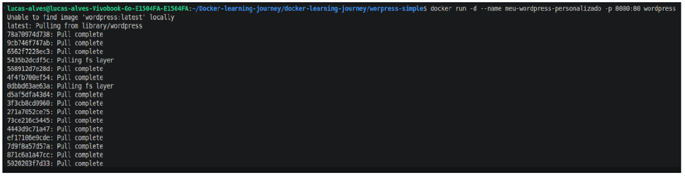
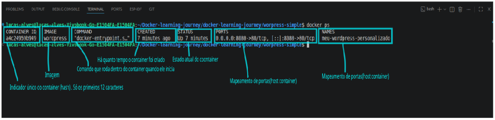
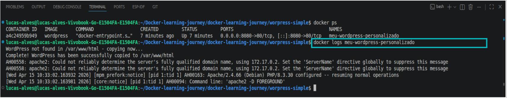
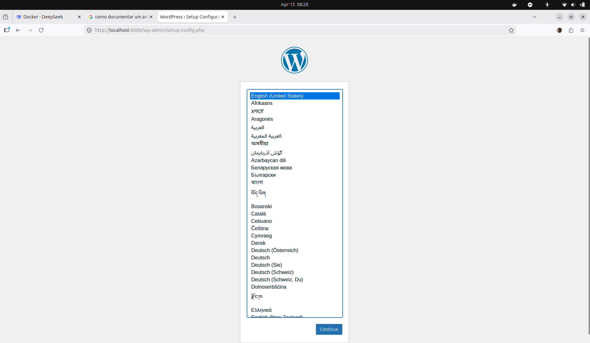

# 🐳 Docker - Nível Júnior para Pleno

## Exercício básico do dia a dia: WordPress Simples

## Baixando wordpress
**docker run -d --name meu-wordpress-personalizado -p 8080:80 wordpress**  
* **docker run** Comando principal, cria e inicia um container**

* **-d** È o detached mode, roda em segundoo plano para não bloquear o terminal

* **--name meu-worldpress-personalizado** Ao invés de um ID aleatório, o container se chama meu-wordpress-personalizado e, você pode colocar qualquer apelido

* **-p 8080:80** Port mapping, UQalquer acesso à porta 8080 do seu computador vai para a porta 80 dentro do container

* **wordpress** wordpress é a imagem oficial do wordpress do Docker Hub

1. Após rodar o comando 
--- 

---
2. Verificar se está rodando (Comando muito usado no dia a dia)
* **docker ps**
---

---
3. Após rodar o docker ps, é essencial praticar a leitura dos logs. 
 **com a tecla TAB é possivel completar o nome do container que criou.
* **docker logs meu-wordpress-personalizado**
---

---

Observe-se que após rodar o comando, aparece que o wordpress foi baixado com sucesso no diretório /var/www/html
Vamos abrir o navegador de tentar abrir a pagina de boas vindas do wordpress através do localhost, assim verificamos a comunicação da porta 8080 do computador com a porta 80 do container.

---

---
85
# Página aberta com sucesso !!!!!!!!
# Vamos recaptular oque aprendemos de básico de um júnior.
`O que foi feito?`
Wordpress simples- baixando a imagem do wordpress com docker run e seus demais atributos**
o comando usado foi **docker run -d --name  meu-wordpress-personalizado -p 8080:80 wordpress**

O que cada parte significa?  

**docker run:** Este comando faz algo além de docekr pull (Não visto aqui). O docker pull baixa a imagem e apenas isto. O docker run baixa a imagem se caso não existir + cria um container + roda este container.  

**-d:** roda em segundo plano(detached) não deixando o console ficar bloaqueado em quanto a sua operação está rodando.  
**-p 8080:80 :** Mapeia a porta 8080 do seu computador para a porta 80 dentro do container.  
**wordpress** é a imagem que desejamos, podendo ser qualquer outra imagem

NOTA!!  
Não useu `docker pull` e sim `docker run`, porque?  
Por que docker run faz o trabelho do pull para caso a imagem não existir e assim que baixar, já cria um contianr e roda em seguida.

---

BONUS  
Talvez você queira parar o docker:  
**Use o comando: docker stop minha-imagem**  
Para inicializar novamente use:  
**docker start minha-imagem**  
Para reiniciar o docker use:  
**docker restart minha-imagem**  
E para verificar o status dele use:  
**docker ps**   
ou   
**docker ps -a**  

Faça um teste com os dois comandos:
docker stop meu-container E docker start meu-container para ver a perda de comunicação e a volta dele

