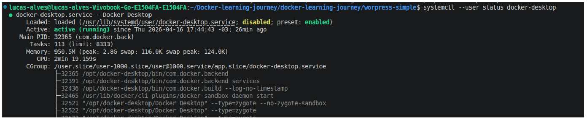
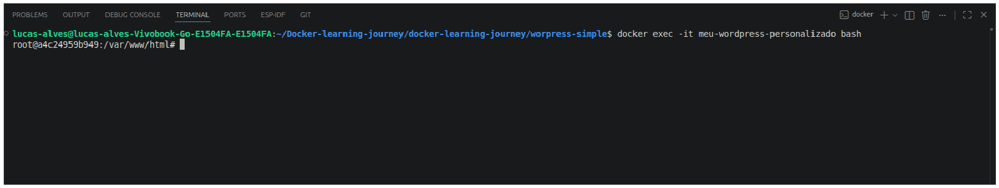
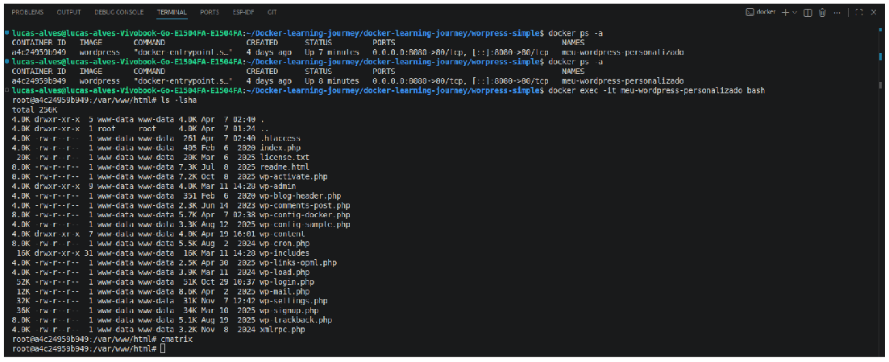
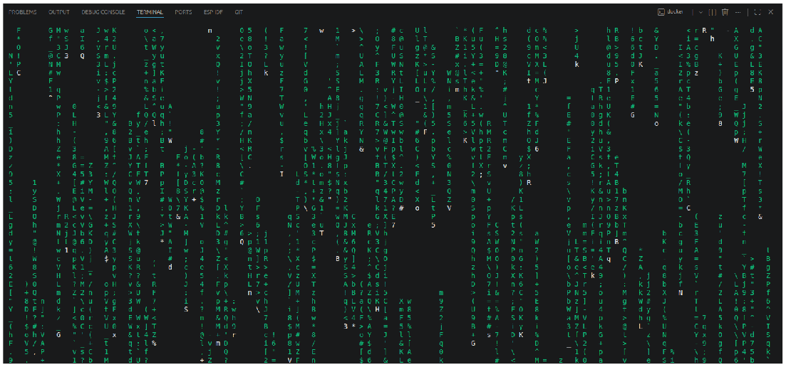
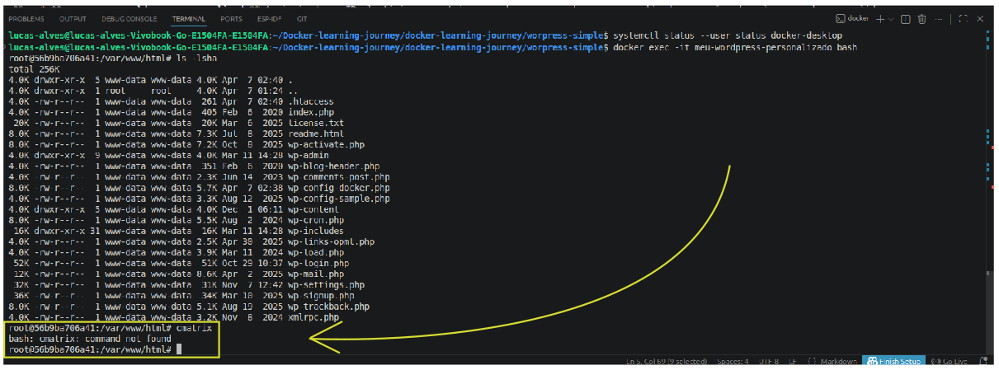
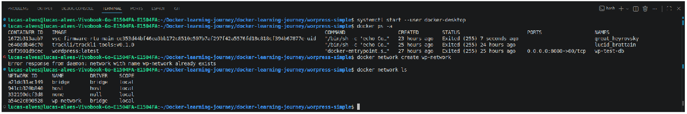
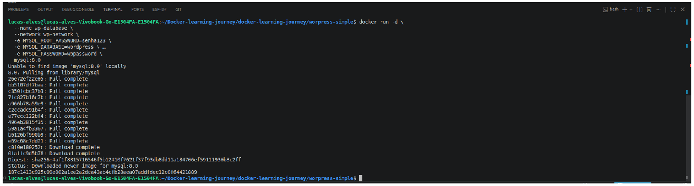
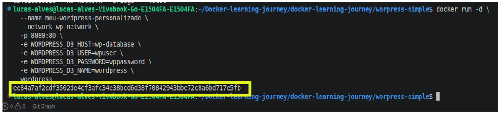

# 🐳 Docker - Nível Júnior para Pleno

## Exercício básico do dia a dia: WordPress Simples
**Primeiro de tudo, deve-se baixar o docker desktop - Maneira mais fácil e mais produtiva de trabalhar e executar comandos**  
1. Após instalar o docker-desktop, utilize o comando `sudo systemctl --user start docker-desktop` para inicializar o docker-desktop (è uma das maneiras de se trabalhar com docker, não se prenda á um único modo). Após isso pode usar o comando `docker start meu-container` para inicializar o container especifico. 

⚠️ AVISO!  
Nesta primeira faze de aprendizado, tudo o que fazer dentro do container e deleta-lo após SERÁ PERDIDO.  
Na segunda parte (Nível Pleno) será abordado o conceito de `Volume` que armazena seus conteúdo após deletar o container.




## Baixando wordpress
**docker run -d --name meu-wordpress-personalizado -p 8080:80 wordpress**  
* **docker run** Comando principal, cria e inicia um container**

* **-d** È o detached mode, roda em segundoo plano para não bloquear o terminal

* **--name meu-worldpress-personalizado** Ao invés de um ID aleatório, o container se chama meu-wordpress-personalizado e, você pode colocar qualquer apelido

* **-p 8080:80** Port mapping, UQalquer acesso à porta 8080 do seu computador vai para a porta 80 dentro do container

* **wordpress** wordpress é a imagem oficial do wordpress do Docker Hub

1. Após rodar o comando 
--- 

---
2. Verificar se está rodando (Comando muito usado no dia a dia)
* **docker ps**
---

---
3. Após rodar o docker ps, é essencial praticar a leitura dos logs. 
 **com a tecla TAB é possivel completar o nome do container que criou.
* **docker logs meu-wordpress-personalizado**
---

---

Observe-se que após rodar o comando, aparece que o wordpress foi baixado com sucesso no diretório /var/www/html
Vamos abrir o navegador de tentar abrir a pagina de boas vindas do wordpress através do localhost, assim verificamos a comunicação da porta 8080 do computador com a porta 80 do container.

---


---

# Página aberta com sucesso !!!!!!!!
# Vamos recaptular oque aprendemos de básico de um júnior.
`O que foi feito?`
Wordpress simples- baixando a imagem do wordpress com docker run e seus demais atributos**
o comando usado foi **docker run -d --name  meu-wordpress-personalizado -p 8080:80 wordpress**

O que cada parte significa?  

**docker run:** Este comando faz algo além de docekr pull (Não visto aqui). O docker pull baixa a imagem e apenas isto. O docker run baixa a imagem se caso não existir + cria um container + roda este container.  

**-d:** roda em segundo plano(detached) não deixando o console ficar bloaqueado em quanto a sua operação está rodando.  
**-p 8080:80 :** Mapeia a porta 8080 do seu computador para a porta 80 dentro do container.  
**wordpress** é a imagem que desejamos, podendo ser qualquer outra imagem

NOTA!!  
Não useu `docker pull` e sim `docker run`, porque?  
Por que docker run faz o trabelho do pull para caso a imagem não existir e assim que baixar, já cria um contianr e roda em seguida.

---

BONUS  
Talvez você queira parar o docker:  
**Use o comando: docker stop minha-imagem**  
Para inicializar novamente use:  
**docker start minha-imagem**  
Para reiniciar o docker use:  
**docker restart minha-imagem**  
E para verificar o status dele use:  
**docker ps**   
ou   
**docker ps -a**  

🔑 Faça um teste com os dois comandos:
docker stop meu-container E docker start meu-container para ver a perda de comunicação e a volta dele


---

## 📋 COMANDOS ESSENCIAIS - Nível Júnior

| Comando | O que faz |
|---------|-----------|
| `docker ps` | Lista containers em execução |
| `docker ps -a` | Lista TODOS os containers (incluindo parados) |
| `docker logs NOME` | Mostra os logs do container |
| `docker stop NOME` | Para um container em execução |
| `docker start NOME` | Inicia um container parado |
| `docker restart NOME` | Reinicia um container |
| `docker rm NOME` | Remove um container (precisa estar parado) |
| `docker exec -it NOME bash` | **Entra DENTRO do container** (modo interativo) |
 

 


 📌NOTA

 Para fechar com chave de ouro experimente o comando:  
 `docker exec -it NOME-DO-CONTAINER bash`  
 Este comando entra dentro do container, é como se fosse o terminal do linux e é essencial para debug - Um dos comandos mais usados por Plenos e Seniores.


 

E quando estou dentro do container é como se fosse eu estar dentro da minha maquina linux instalando pacotes como editores nano, vim ou até mesmo acesando comandos de navegação.

## 📢 Importante 📢 

Você NÃO pode instalar pacotes gráficos por mera definição de que o docker não nasceu para fornecer isso. E nem tente instalar um docker dentro do outro pois apesar de ser uma téncnica avançada, não faz sentido fazer isso no nível júnior ao pleno, principalmente quando está aprendendo a mexer com docker.

Você pode instalar o git local mas não github-Desktop.
Você pode usar comandos de navegação como `ls -lsha`, `pwd`, `cd /var/wwww/html` .... 

## `docker exec -it container bash` - Dentro do container

Ao executar este comando, você entra **DENTRO** do container em um terminal Linux.

### O que posso fazer dentro do container?

✅ **Instalar programas de terminal:**
- Editores: `vim`, `nano`
- Ferramentas: `curl`, `wget`, `git`
- Linguagens: `python3`, `node`, `gcc`  

✖️ **O que NÃO faz sentido:**
- VS Code, GitHub Desktop, navegadores (precisam de interface gráfica)

### Exemplo prático:

# Entrar no container
- docker exec -it meu-wordpress bash

# Instalar git e curl (Exemplo do que pode instalar)
- apt update && apt install -y git curl

# Para finalizar este nível Júnior.
Proponho dois exercicios didáticos que irá preparar sua mente para o nível Pleno. São eles:
- Entendendo a fragilidade (Por que precisamos de volumes)
- Wordpress + MySQL (Te preparando para Docker Compose)

Antes que você saia pesquisando, eu respondo agora mesmo. Docker Compose é uma ferramenta de orquestração que permite definir e executar aplicações com múltiplos conteineres utilizando um único arquivo de configuração YAML. Ou seja, para 90% dos casos em que é preciso de um banco de dados ou qualquer outro sisitema auxiliar que deve se comunicar com o sisitema principal é preciso que containeres se comuniquem - Por isso a importância do Docker compose

🛠️ Mão na massa.

Entendendo a fragilidade (por que precisamos de volumes)

Este exercico mostra **O problema** que os volumes resolvem  

**Objetivo**  
Mostrar que dados dentro do container somem quando ele é removido.  

Siga o passo a passo.
1. Rode o Wordpress (sem volumes)  
- docker run -d --name wp-teste -p 8080:80 worpress   # Aqui esta criando outro container com a mesma imagem wordpress  
2. Acesse http://localhost:8080 em algum navegador e faça a instalação de algum pacote - neste exemplo eu instalei a chuva digital, o famoso efeito do filme matrix 
- Entre no container através do comando `docker exec -it meu-container bash`  
- uma vez dentro do container. Instale o pacote.  
- `apt update && apt install cmatrix` &emsp;&emsp;&emsp;&emsp; *# neste caso como você está dentro do container, não é preciso do comando "sudo"*
 
  
**Após rodar o comando cmatrix**  

<br><br>
Nos meus exemplos estou a usar o VSCode, e exeiste um atalho para ativar ou desativar o terminal de comando do VSCode - CRL+j.  
<br><br>  

3. Remova o container  
Para sair do bash do container, uitliza o comando exit.  
```bash
docker stop wp-teste    # Para o container primeiro.
docker rm wp-teste      # Depois remova.
```

4. Rode um **novo** wordPress   
docker run -d --name wp-teste -p 8080:80 wordpress  

5. Acesse http://localhost:8080 novamente  para verificar o acesso.
6. Entra no bash do seu container via `docker exe -it meu-container bash`  



7. Todo o conteúdo que vocẽ criou sumiu.  

**Vamos entender o que aconteceu.**  
O exercício 1.5 mostra a fragilidade dos containers, pois ao remover *docker rm _______* todos os dados são removidos. 
Por natureza os containeres são efêmeros por designer, os arquivos só existem enquanto o container exisitir.
**Solução (Próximo nível):** Usar **Volumes** para persistir dados fora do container. Veremos isso adiante.

# 📝 Exercicio 1.6: Wordpress + MySQL (Te preparando para Docker Compose)#

Neste exercício, vou abordar um conceito muito importânte sobre coordenar varios containeres (orquestração). Não diga adminstrar containeres por que adminstrar tem conceito diferente, o termo administrar refere-se à algo isolado, enquanto orquestrar se refere a coordenar vários itens diferentes para andar em sincronia como é o caso de orquestar vários instrumentos musicais.

Nesta última seção de docker á nível júnior vamos entender por que coordenar vários containers manualmente é doloroso (aqui nós se preparamos para o Docker Compose)

## 🎯 Objetivo do Exercício 1.6 ##   
Mostrar como dois containers diferentes (Wordpress e MySQL) se comunicam através de uma rede Docker para formar um sisitema completo.  

Let's go!!

1. Com o docker instalado e uma imagem preparada. Crie uma rede para os containers se comunicarem.
- `docker network create wp-teste`
Você pode visualizar as redes criadas usando o comando  `docker network ls` e a saída terá algo semelhante à.  

  

2. Rode o MySQL (banco de dados)  
- docker run -d \
    --name wp-database \
    -e MYSQL_ROOT_PASSWORD=senha123 \
    -e MYSQL_DATABASE=wordpress \
    -e MYSQL_USER=wpuser \
    -e MYSQL_PASSWORD=wppassword \
    mysql:8.0

  
 


 🚀Dica apra progredir! pesquise sobre as definições aicma, pois estas definições como password, --network, --name..etc são muito importantes na hora de cirar o banco de dados.  

 3. Rode o wordpress conectado ao MYSQL.  
   docker run -d \  
  --name meu-wordpress-personalizado \
  --network wp-network \
  -p 8080:80 \
  -e WORDPRESS_DB_HOST=wp-database \
  -e WORDPRESS_DB_USER=wpuser \
  -e WORDPRESS_DB_PASSWORD=wppassword \
  -e WORDPRESS_DB_NAME=wordpress \
  wordpress

  

4. Teste a comunicação entre os containeres. 
- Verifique se os dois containeres estão rodando `docker ps `
- acesse o localhost para verificar o wordpress funcionando  

5. O Exercício 1.6 só faz sentido se você criar conteúdo no WordPress para ver que os dados estão persistindo no MySQL (e não no container do WordPress).   
   Sem conteúdo, você não vê a "mágica" acontecendo. vamos criar um conteúdo qua salve dados no banco de dados.
- Para isto, complete as informações da página do wordpress acessando o localhost.  
- Complete a instalação do WordPress:

    * Título do site: "Meu Blog Docker"

    * Usuário: admin

    * Senha: admin123 (escolha uma)

    * Email: admin@exemplo.com  
6. CRIE CONTEÚDO (isso é essencial!):

    * Vá em Posts → Add New

    * Crie um post: "Meu primeiro post no Docker"

    * Publique

    * Adicione um comentário de teste  

7. Provar que os dados estão no MySQL  
Aqui vamos fazer o teste que mostra a mágica.  
    * Teste 1: Pare o wordpress (Não o DB!!!)  
    `docker stop wp-wordpress`  
    * Teste 2: Inicie o wordpress novamente e acesse o localhost e verá que seu post ainda está lá.
    `docker start w-wordpress`  

Oque significa? significa que o psot está no Database e não no worpress

8. Deleta o Database e recria. Com isto você verá que os dados foram apagados e entenderá que o post esta mesmo no database.  
    `docker stop wp-database`  *È preciso parar o container para poder deletar*  
    `docker rm wp-database`  

    *Recria o DB*

    `docker run -d \  `  
  ` --name wp-database \  `  
  `--network wp-network \  `  
  `-e MYSQL_ROOT_PASSWORD=senha123 \ `    
  `-e MYSQL_DATABASE=wordpress \  `  
  `-e MYSQL_USER=wpuser \  `  
  `-e MYSQL_PASSWORD=wppassword \ `    
  `mysql:8.0`  `  

O que você tem de resultado? Seu post sumiu por que foi deletado com o DB.  

# 💡 Resumo visual da ópera
## 🔄 Comparação Visual: Sem Banco vs Com Banco de Dados

### ❌ Sem banco de dados (Exercício 1.5)

| Etapa | Estado |
|-------|--------|
| 1 | 📦 **WordPress Container** (com dados dentro) |
| 2 | ⬇️ `docker rm` |
| 3 | 💥 **DADOS SUMEM** ❌ |

### ✅ Com banco de dados (Exercício 1.6)

| Etapa | WordPress Container | MySQL Container |
|-------|---------------------|-----------------|
| 1 | 📦 Aplicação rodando | 🗄️ Dados armazenados |
| 2 | ⬇️ `docker rm` | 🗄️ Dados persistem |
| 3 | 🆕 **Container NOVO** | 🗄️ Dados ainda lá |
| 4 | ✅ **Dados recuperados!** | 🗄️ Intacto |

---

## 📌 Menção Final

Este documento faz parte da minha jornada de aprendizado em Docker, do nível Júnior ao Pleno.

📅 **Última atualização:** Abril/2026  

> *"A jornada de mil containers começa com um `docker run`."* 🚀  
---

## 🎯 Próximos Passos (Nível Pleno)

Este foi o fim da primeira parte. O que vem por aí:

| Conceito | O que você vai aprender |
|----------|------------------------|
| **Volumes** | Persistir dados de forma profissional |
| **Dockerfile** | Criar suas próprias imagens |
| **Docker Compose** | Orquestrar sistemas completos com 1 comando |
| **Boas práticas** | Imagens menores, builds mais rápidos, segurança |

📬 **Sugestões ou dúvidas?** Abra uma issue no GitHub!

---

✨ *Documentado com 🐳 por Lucas Lorenço Alves - Em evolução para Nível Pleno*
---

